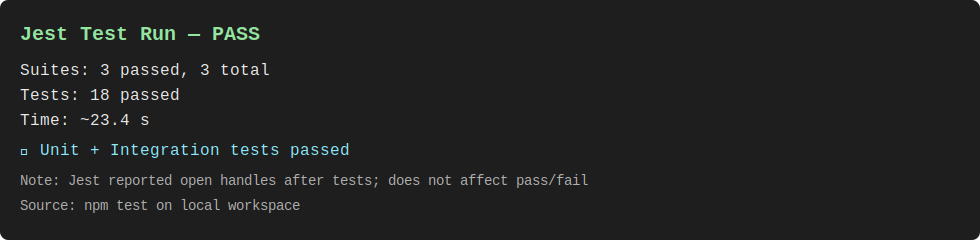

# GAS - GitHub Actions Staging

A production-ready Node.js application demonstrating advanced deployment strategies including Blue-Green and Canary deployments with comprehensive CI/CD pipelines, monitoring, and observability.

## 🚀 Features

- **Multiple Deployment Strategies**
  - Blue-Green deployment for zero-downtime releases
  - Canary deployment with traffic splitting
  - Staging environment for pre-production testing

- **Comprehensive CI/CD**
  - Automated testing (unit, integration, e2e)
  - Docker containerization
  - GitHub Actions workflows
  - Automated rollback capabilities

- **Monitoring & Observability**
  - Prometheus metrics collection
  - Grafana dashboards (RED metrics, Canary comparison)
  - Health check endpoints
  - Performance monitoring

- **Production-Ready**
  - Health checks (liveness, readiness)
  - Graceful shutdown
  - Error handling
  - Security best practices

## 📋 Table of Contents

- [Quick Start](#quick-start)
- [Architecture](#architecture)
- [Local Development](#local-development)
- [Testing](#testing)
- [Deployment](#deployment)
- [Monitoring](#monitoring)
- [API Documentation](#api-documentation)
- [Contributing](#contributing)
- [Screenshots](#screenshots)


## ⚡ Quick Start

### Prerequisites

- Node.js 18 or higher
- Docker and Docker Compose
- Git

### Installation

```bash
# Clone the repository
git clone <your-repo-url>
cd gas_repo_template

# Run automated setup
chmod +x scripts/*.sh
./scripts/local-setup.sh
```

This will:
1. Install all dependencies
2. Create environment configuration
3. Build Docker images
4. Start monitoring stack (Prometheus + Grafana)
5. Run tests

### Start the Application

```bash
# Development mode with hot reload
npm run dev

# Production mode
npm start

# Using Docker
docker build -t gas-app -f docker/Dockerfile .
docker run -p 3000:3000 gas-app
```

Access the application at http://localhost:3000

## 🏗️ Architecture

```
gas_repo_template/
├── .github/
│   └── workflows/          # CI/CD pipelines
│       ├── ci.yml          # Continuous Integration
│       ├── cd-staging.yml  # Staging deployment
│       ├── cd-production.yml # Production deployment
│       ├── canary.yml      # Canary deployment
│       └── rollback.yml    # Rollback procedures
├── src/
│   ├── index.js           # Main application
│   ├── health.js          # Health check endpoints
│   └── metrics.js         # Prometheus metrics
├── tests/
│   ├── unit/              # Unit tests
│   ├── integration/       # Integration tests
│   └── e2e/               # End-to-end tests
├── docker/
│   ├── Dockerfile         # Application container
│   └── docker-compose.yml # Monitoring stack
├── infra/
│   └── monitoring/        # Monitoring configuration
│       ├── prometheus-config.yml
│       ├── nginx.conf
│       └── grafana-dashboards/
├── scripts/               # Deployment simulation scripts
└── docs/                  # Documentation
```

## 💻 Local Development

### Environment Variables

Create a `.env` file (or copy from `.env.example`):

```env
NODE_ENV=development
PORT=3000
DEPLOYMENT_TYPE=local
LOG_LEVEL=info
```

### Development Commands

```bash
# Install dependencies
npm install

# Run in development mode
npm run dev

# Run tests
npm test                    # All tests
npm run test:unit          # Unit tests only
npm run test:integration   # Integration tests only
npm run test:e2e          # E2E tests only
npm run test:coverage     # With coverage report

# Linting
npm run lint              # Check for issues
npm run lint:fix          # Fix issues automatically

# Docker
npm run docker:build      # Build Docker image
npm run docker:run        # Run container
```

## 🧪 Testing

### Test Structure

- **Unit Tests**: Test individual functions and modules
- **Integration Tests**: Test API endpoints and interactions
- **E2E Tests**: Test complete user workflows

### Running Tests

```bash
# Run all tests
npm test

# Run with coverage
npm run test:coverage

# Run specific test file
npm test tests/unit/health.test.js

# Watch mode for development
npm test -- --watch
```

### Coverage Thresholds

- Branches: 50%
- Functions: 60%
- Lines: 70%
- Statements: 70%

## Screenshots

Place screenshots in docs/images and name them as below. The images will render automatically on GitHub once you add the files.

- GitHub Actions CI (snapshot): 
- Local Jest Tests (passing): 
- Coverage Summary: 

How to capture and add:
1. Re-run tests locally: `npm test` (or `npm run test:unit` / `npm run test:integration`).
2. Take screenshots of your terminal results and the GitHub Actions run page (Actions → CI).
3. Save them into docs/images using the names above (or update the paths here).
4. Commit and push: `git add docs/images && git commit -m "docs: add CI/test screenshots" && git push`.

## 🚢 Deployment

### Deployment Strategies

#### 1. Blue-Green Deployment

Zero-downtime deployment with instant rollback capability.

**Local Simulation:**
```bash
./scripts/simulate-blue-green.sh
```

**Production:**
- Triggered on push to `main` branch
- Deploys to inactive slot
- Runs tests
- Swaps slots

#### 2. Canary Deployment

Gradual rollout with traffic splitting.

**Local Simulation:**
```bash
# 10% canary traffic
./scripts/simulate-canary.sh 10

# 25% canary traffic
./scripts/simulate-canary.sh 25
```

**Production:**
- Manually triggered via GitHub Actions
- Configurable traffic percentage
- Monitoring period before promotion

#### 3. Staging Deployment

Pre-production testing environment.

**Trigger:**
- Push to `develop` branch
- Automated deployment to staging slot

### Rollback

**Automatic Rollback:**
- Triggered on health check failures
- Triggered on test failures

**Manual Rollback:**
```bash
# Via GitHub Actions
# Go to Actions → Rollback Deployment → Run workflow
```

See [DEPLOYMENT.md](docs/DEPLOYMENT.md) for detailed deployment guide.

## 📊 Monitoring

### Monitoring Stack

The project includes a complete monitoring stack:

- **Prometheus**: Metrics collection (http://localhost:9090)
- **Grafana**: Visualization (http://localhost:3001)
  - Default credentials: `admin/admin`

### Starting Monitoring Stack

```bash
cd docker
docker-compose up -d
```

### Available Dashboards

1. **RED Metrics Dashboard**
   - Request Rate
   - Error Rate
   - Duration (Latency)

2. **Canary Comparison Dashboard**
   - Side-by-side comparison of stable vs canary
   - Error rate comparison
   - Latency comparison

### Metrics Endpoints

- `/metrics` - Prometheus metrics
- `/health` - Detailed health information
- `/health/live` - Liveness probe
- `/health/ready` - Readiness probe

## 📚 API Documentation

### Endpoints

#### `GET /`
Returns application information and available endpoints.

**Response:**
```json
{
  "message": "GAS - GitHub Actions Staging Application",
  "version": "1.0.0",
  "deploymentType": "local",
  "endpoints": [...]
}
```

#### `GET /health`
Detailed health check with system information.

**Response:**
```json
{
  "status": "healthy",
  "version": "1.0.0",
  "timestamp": "2024-01-01T00:00:00.000Z",
  "uptime": 123.45,
  "system": {
    "platform": "linux",
    "arch": "x64",
    "nodeVersion": "v18.0.0"
  },
  "process": {
    "pid": 1,
    "memory": {...}
  }
}
```

#### `GET /health/live`
Kubernetes liveness probe endpoint.

**Response:**
```json
{
  "status": "alive",
  "timestamp": "2024-01-01T00:00:00.000Z"
}
```

#### `GET /health/ready`
Kubernetes readiness probe endpoint.

**Response:**
```json
{
  "status": "ready",
  "timestamp": "2024-01-01T00:00:00.000Z"
}
```

#### `GET /metrics`
Prometheus metrics in text format.

**Response:**
```
# HELP gas_http_requests_total Total number of HTTP requests
# TYPE gas_http_requests_total counter
gas_http_requests_total{method="GET",route="/",status="200"} 42
...
```

#### `GET /api`
API status endpoint.

**Response:**
```json
{
  "message": "API is working",
  "version": "1.0.0",
  "timestamp": "2024-01-01T00:00:00.000Z"
}
```

#### `GET /api/data`
Returns sample data.

**Response:**
```json
{
  "data": [
    {"id": 1, "name": "Item 1"},
    {"id": 2, "name": "Item 2"}
  ],
  "count": 2
}
```

#### `GET /api/slow?delay=<ms>`
Simulates slow response for testing.

**Query Parameters:**
- `delay` (optional): Delay in milliseconds (default: 1000)

**Response:**
```json
{
  "message": "Slow response completed",
  "delay": 1000
}
```

#### `GET /api/error`
Simulates error for testing.

**Response:** 500 Internal Server Error
```json
{
  "error": "Simulated error for testing"
}
```

## 🔧 Configuration

### Environment Variables

| Variable | Description | Default | Required |
|----------|-------------|---------|----------|
| `NODE_ENV` | Environment (development/production/test) | `development` | No |
| `PORT` | Server port | `3000` | No |
| `DEPLOYMENT_TYPE` | Deployment type (stable/canary/blue/green) | `local` | No |
| `LOG_LEVEL` | Logging level (debug/info/warn/error) | `info` | No |

### GitHub Secrets

Required for CI/CD pipelines:

| Secret | Description |
|--------|-------------|
| `ACR_LOGIN_SERVER` | Azure Container Registry URL |
| `ACR_USERNAME` | ACR username |
| `ACR_PASSWORD` | ACR password |
| `AZURE_CREDENTIALS` | Azure service principal credentials |
| `AZURE_RESOURCE_GROUP` | Azure resource group name |

## 🤝 Contributing

### Development Workflow

1. Fork the repository
2. Create a feature branch (`git checkout -b feature/amazing-feature`)
3. Make your changes
4. Run tests (`npm test`)
5. Run linting (`npm run lint`)
6. Commit your changes (`git commit -m 'Add amazing feature'`)
7. Push to the branch (`git push origin feature/amazing-feature`)
8. Open a Pull Request

### Code Style

- Follow ESLint configuration (Airbnb style guide)
- Write tests for new features
- Maintain test coverage above 70%
- Document public APIs

### Commit Messages

Follow conventional commits:
- `feat:` New feature
- `fix:` Bug fix
- `docs:` Documentation changes
- `test:` Test changes
- `chore:` Maintenance tasks

## 📝 License

This project is licensed under the MIT License - see the LICENSE file for details.

## 🙏 Acknowledgments

- Express.js for the web framework
- Prometheus for metrics collection
- Grafana for visualization
- GitHub Actions for CI/CD
- Azure for cloud hosting

## 📞 Support

- **Issues**: [GitHub Issues](https://github.com/yourusername/gas_repo_template/issues)
- **Discussions**: [GitHub Discussions](https://github.com/yourusername/gas_repo_template/discussions)
- **Documentation**: [docs/](docs/)

## 🗺️ Roadmap

- [ ] Add authentication and authorization
- [ ] Implement rate limiting
- [ ] Add database integration
- [ ] Implement feature flags
- [ ] Add more deployment strategies
- [ ] Enhance monitoring dashboards
- [ ] Add performance testing
- [ ] Implement chaos engineering tests

## 📊 Project Status

[](https://github.com/adusei2023/gas_repo_samuel_Adusei_Boateng/actions/workflows/ci.yml)
[](https://github.com/adusei2023/gas_repo_samuel_Adusei_Boateng/actions/workflows/cd-staging.yml)
[](https://github.com/adusei2023/gas_repo_samuel_Adusei_Boateng/actions/workflows/cd-production.yml)

---

**Built with ❤️ for demonstrating modern deployment strategies**
